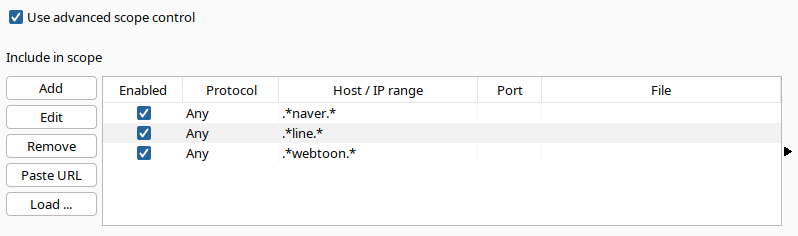
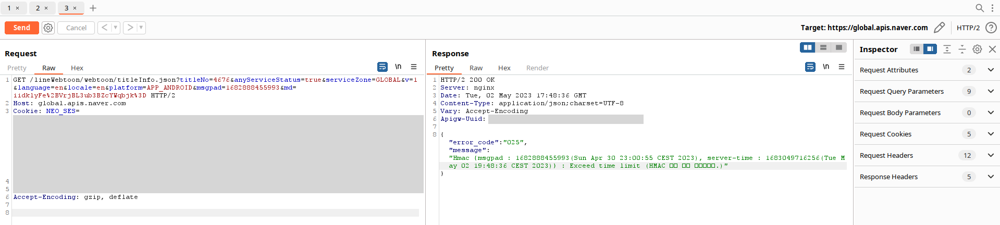
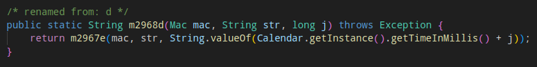
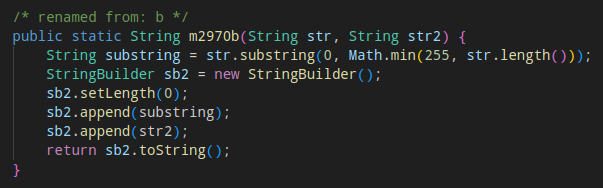
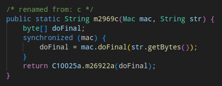
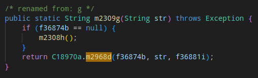
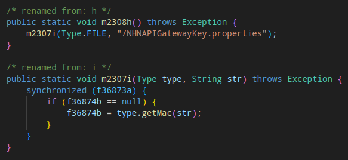
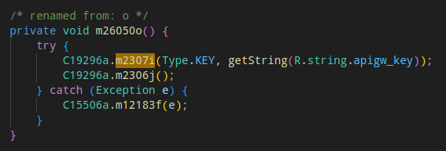
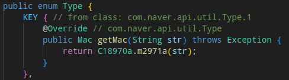
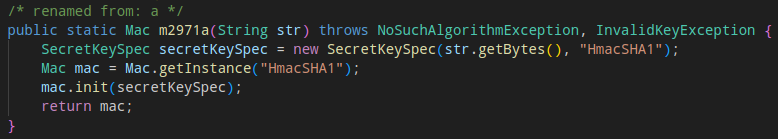

# The reverse engineering process

So, I wanted to find out how webtoon API works for testing if I could easily bypass their payment control for reading some paywalled manhwas. It turned out that I couldn't, but the whole process led to writing this library and pseudo-reverse guide on how I made it. Buckle up.

First things first, the analysed target - website provides you with a ready-made html without any API calls for getting content. Then, we are left with the webtoon mobile apps. Previously I have done a bit of apk reverse engineering for uni courses, so I decided to analyse the Android app.

For analysing web traffic Burp Suite was used as a proxy, you can read about it [here](https://portswigger.net/burp/documentation/desktop/mobile/config-android-device). No ssl pinning is currently present in the app, so we can analyse all requests without patches in the apk. After using the app a bit, I narrowed the api calls to the following scope:

After further inspection, all the "valuable" API calls - i.e. returning manhwa image URLs - seem to be going to global.apis.naver.com

Now, let's try to make a call on our own:

Interesting, seems that out request must be signed with a specific time-stamp. From several experiments we can infer that `msgpad` parameter, that contains the timestamp in milliseconds, must be no more than 2 hours behind the current timestamp and `md` seems to be the request athentication code. To find out how it is made, the next logical step is to reverse-engineer the mobile app.

For reverse-engineering and analysing the app, I used [APKLab](https://apklab.surendrajat.xyz/) VSCode extension. After decompiling the apk, the first search is `msgpad` as it can help us find the url signing algorithm. The search leads us to a deobfucated file - thanks apklab :) - which contains the following function

Here `str` is a url, `str2` is a timestamp and `mac` is a Mac object that somehow gets manipulated in `m2969c`. SIdenote: this function only gets called by another function from the same class

Let's follow the interesting calls inside `m2967e`: first is `m2970b` which simply appends strings

Then the result gets passed down to `m2969c` where it gets processed by mac object and passed on to another function

Here `C10025a.m26922a` is a function that scrambles the passed on bytes, that I rewrote in python without any changes.

Now onto the most important part - how the `mac` object gets initialized. As previously mentioned, the point of entry is `m2968d`, which has a single call in another deobfuscated file

Here `f36874b` is the mac object passed down to previously discussed functions and it seems to get initialized in `m2307i`

Search for `NHNAPIGatewayKey.properties` did not reveal anything in code or in the apk, so the next step is to search for `m2307i` calls. Success, there is another result, now in `LineWebtoonApplication.java`, where it gets called with a supposed API key

Here `Type.KEY` contains `getMac` function that gets used in `m2307i` to the mac from the API key

`C18970a.m2971a` leads us back to the first file, where the `Mac` object gets initialized from the API key converted to bytes and used as an initialization parameter

So the complete algorithm looks like this:
1. `Mac` object gets initialized with API key as an initialization parameter
2. Function for URL signing gets called
3. URL get concatenated with current timestamp
4. The resulting string gets processed by HMAC algorithm
5. The result gets scrambled and returned as `md` parameter in the sent request

All in all, the whole thing represents security through obscurity as the webtoon platform tries to stop potential API through making the whole process more elaborate than it should be.

Keep hacking and thanks for coming to my TED talk.